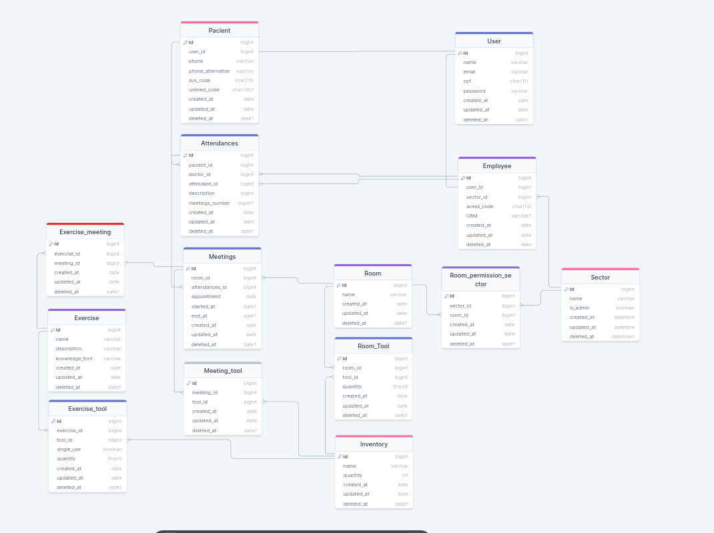

## Projeto Sistema de Atendimento de Fisioterapia

### Grupo C

### Integrantes:

- Vitor Loch - VitorM3 
- Danilo Formanski - Danilean 
- Keniel Nunes - KenielDev 
- Laura Silveira - Laurassilveirag
- Rafael Castro - RafaelDaSilvaCastro
- Vinicius Albino - Shinguek0
- Yuri Lopes - YuriLopesM
- Vitor Minatto - Minattoo

### Modelo Físico:

https://drawsql.app/teams/vitor-loch/diagrams/corpus <br>


### Dicionário de Dados:

/database/doc/dictionary/Corpus Dictionary.xlsx

### Scripts DDL Criação do Database:

Banco de dados utilizado SQL Server versão 2022 - Azure. <br>

/database/code/DDL/tables

```sql
/*Criar tabela de usuários*/
CREATE TABLE "user"(
    id INT IDENTITY(1,1) PRIMARY KEY,
    name VARCHAR(50) NOT NULL,
    email VARCHAR(80) NOT NULL UNIQUE,
    cpf CHAR(11) NOT NULL UNIQUE,
    password VARCHAR(300),
    created_at DATETIME DEFAULT GETDATE(),
    deleted_at DATETIME,
);
/*===============================================================================================*/
/*Criar tabela de pacientes*/
CREATE TABLE pacient(
id INT IDENTITY(1,1) PRIMARY KEY,
user_id INT NOT NULL,
phone VARCHAR(15) NOT NULL UNIQUE,
phone_alternative VARCHAR(15) NOT NULL,
sus_code CHAR(15) NOT NULL UNIQUE,
unimed_code CHAR(15) UNIQUE,
created_at DATETIME DEFAULT GETDATE(),
deleted_at DATETIME,
CONSTRAINT fk_user FOREIGN KEY (user_id) REFERENCES "user"(id)
);
/*============================================================================================*/
/*Criar Tabela de Setores*/
CREATE TABLE sector(
id INT IDENTITY(1,1) PRIMARY KEY,
name VARCHAR(50) NOT NULL UNIQUE,
created_at DATETIME DEFAULT GETDATE(),
deleted_at DATETIME,
);
/*============================================================================================*/
/*Criar Tabela de Funcionários*/
CREATE TABLE employee(
id INT IDENTITY(1,1) PRIMARY KEY,
user_id INT NOT NULL,
sector_id INT NOT NULL,
access_code CHAR(12) NOT NULL,
created_at DATETIME DEFAULT GETDATE(),
deleted_at DATETIME,
CONSTRAINT fk_user_employee FOREIGN KEY (user_id) REFERENCES "user"(id),
CONSTRAINT fk_sector_employee FOREIGN KEY (sector_id) REFERENCES "sector"(id)
);
/*============================================================================================*/
/*Criar tabela de atendimentos*/
CREATE TABLE attendances(
id INT IDENTITY(1,1) PRIMARY KEY,
pacient_id INT NOT NULL,
doctor_id INT NOT NULL,
attendant_id INT NOT NULL,
meetings_number INT NOT NULL DEFAULT 1,
description VARCHAR(500) NOT NULL,
created_at DATETIME DEFAULT GETDATE(),
deleted_at DATETIME,
CONSTRAINT fk_pacient_attendances FOREIGN KEY(pacient_id) REFERENCES pacient(id),
CONSTRAINT fk_doctor_attendances FOREIGN KEY (doctor_id) REFERENCES employee(id),
CONSTRAINT fk_attendant_attendances FOREIGN KEY (attendant_id) REFERENCES employee(id)
);
/*===============================================================================================*/
/*Criar Tabela de Salas*/
CREATE TABLE room (
id INT IDENTITY(1,1) PRIMARY KEY,
name VARCHAR(60) NOT NULL UNIQUE,
occupied BIT NOT NULL DEFAULT 0,
created_at DATETIME DEFAULT GETDATE(),
deleted_at DATETIME,
);
/*==============================================================================================*/
/*Criar tabela de permissões de cada setor para as salas*/
CREATE TABLE room_permission_sector(
ID INT IDENTITY(1,1) PRIMARY KEY,
sector_id INT NOT NULL,
room_id INT NOT NULL,
created_at DATETIME DEFAULT GETDATE(),
deleted_at DATETIME,
CONSTRAINT fk_sector_room_permission_sector FOREIGN KEY (sector_id) REFERENCES sector(id),
CONSTRAINT fk_room_room_permission_sector FOREIGN KEY (room_id) REFERENCES room(id),
);
/*==============================================================================================*/
/*Criar Estoque*/
CREATE TABLE inventory(
id INT IDENTITY(1,1) PRIMARY KEY,
name VARCHAR(50) NOT NULL UNIQUE,
quantity TINYINT NOT NULL,
created_at DATETIME DEFAULT GETDATE(),
deleted_at DATETIME
);
/*==============================================================================================*/
/*Criar Encontro de um atendimento*/
CREATE TABLE meeting(
id INT IDENTITY(1,1) PRIMARY KEY,
room_id INT NOT NULL,
attendances_id INT NOT NULL,
appointment DATETIME NOT NULL,
started_at DATETIME,
end_at DATETIME,
created_at DATETIME DEFAULT GETDATE(),
deleted_at DATETIME,
CONSTRAINT fk_room_meeting FOREIGN KEY(room_id) REFERENCES room(id),
CONSTRAINT fk_attendances_meeting FOREIGN KEY (attendances_id) REFERENCES attendances(id)
);
/*==============================================================================================*/
/*Criar Itens utilizados no encontro */
CREATE TABLE meeting_tool(
    id INT IDENTITY(1,1) PRIMARY KEY,
    meeting_id INT NOT NULL,
    tool_id INT NOT NULL,
    quantity INT NOT NULL DEFAULT 1,
    created_at DATETIME DEFAULT GETDATE(),
    deleted_at DATETIME,
    CONSTRAINT fk_meeting_meeting_tool FOREIGN KEY (meeting_id) REFERENCES meeting(id),
    CONSTRAINT fk_tool_meeting_tool FOREIGN KEY (tool_id) REFERENCES inventory(id)
);
/*=============================================================================================*/
/*Criar Exercicios*/
CREATE TABLE exercise(
id INT IDENTITY(1,1) PRIMARY KEY,
name VARCHAR(50) NOT NULL UNIQUE,
description VARCHAR(500) NOT NULL,
knowledge_font VARCHAR(150) NOT NULL,
created_at DATETIME DEFAULT GETDATE(),
deleted_at DATETIME
);
/*===========================================================================================*/
/*Criar Itens utilizados em cada exercicio*/
CREATE TABLE exercise_tool(
    id INT IDENTITY(1,1) PRIMARY KEY,
    exercise_id INT NOT NULL,
    tool_id INT NOT NULL,
    quantity INT NOT NULL DEFAULT 1,
    created_at DATETIME DEFAULT GETDATE(),
    deleted_at DATETIME,
    CONSTRAINT fk_exercise_exercise_tool FOREIGN KEY (exercise_id) REFERENCES exercise(id),
    CONSTRAINT fk_tool_exercise_tool FOREIGN KEY (tool_id) REFERENCES inventory(id)
);
/*===========================================================================================*/
/*Criar tabela de exercícios feitos em cada encontro*/
CREATE TABLE exercise_meeting(
    id INT IDENTITY(1,1) PRIMARY KEY,
    exercise_id INT NOT NULL,
    meeting_id INT NOT NULL,
    created_at DATETIME DEFAULT GETDATE(),
    deleted_at DATETIME,
    CONSTRAINT fk_exercise_exercise_meeting FOREIGN KEY (exercise_id) REFERENCES exercise(id),
    CONSTRAINT fk_meeting_exercise_meeting FOREIGN KEY (meeting_id) REFERENCES meeting(id),
);
/*=========================================================================================*/
/*Criar tabela de itens de uma sala*/
CREATE TABLE room_tool (
ID INT IDENTITY(1,1) PRIMARY KEY,
tool_id INT NOT NULL,
room_id INT NOT NULL,
quantity INT NOT NULL DEFAULT 1,
created_at DATETIME DEFAULT GETDATE(),
deleted_at DATETIME,
CONSTRAINT fk_tool_room_tool FOREIGN KEY (tool_id) REFERENCES inventory(id),
CONSTRAINT fk_room_room_tool FOREIGN KEY (room_id) REFERENCES room(id),
);
/*========================================================================================*/
```

### Scripts Popula tabelas:

Banco de dados utilizado SQL Server versão 2022 - Azure.

/database/code/DML

```sql
    /*========================================================================================*/

/*Insere os dados do usuario */

SET IDENTITY_INSERT "user" ON


-- Criando os usuarios dos integrantes do grupo
insert into "user"(id, name, email, cpf, password)
values
(1, 'Usuario','usuario@email.com','00000000000',dbo.f_encript_password('abc123')),
(2, 'Vitor Loch','vitorLolo@gmail.com','71518756636',dbo.f_encript_password('vitao123')),
(3, 'Danilo Formanski','danilean@gmail.com','12711244409',dbo.f_encript_password('danilean123')),
(4, 'Keniel Nunes','keniel@gmail.com','53691070878',dbo.f_encript_password('keniel123')),
(5, 'Laura Silveira','Laura@gmail.com','18851828975',dbo.f_encript_password('laura123')),
(6, 'Rafael Castro','rafael@gmail.com','24655424601',dbo.f_encript_password('rafael123')),
(7, 'Vinicius Albino','bino@gmail.com','98515198891',dbo.f_encript_password('bino123')),
(8, 'Yuri Lopes','limit1@gmail.com','10434628525',dbo.f_encript_password('limitado123')),
(9, 'Vitor Minatto Namikaze','MinattoNamikazeOFC@gmail.com','66577634079',dbo.f_encript_password('o4hokage'));

-- popula�ao da tabela
insert into "user"(id, name, email, cpf, password)
values
    (10, 'Brittany Allen','Brittany403@yahoo.com','16331459636',dbo.f_encript_password('Brittany123')),
    (11, 'Marcus Tapia','Marcus737@yahoo.com','68673234589',dbo.f_encript_password('Marcus123')),
    (12, 'Robert King','Robert391@hotmail.com','42235095852',dbo.f_encript_password('Robert123')),
    (13, 'Austin Reed','Austin795@hotmail.com','41994740870',dbo.f_encript_password('Austin123')),
    (14, 'Eileen Rivera','Eileen166@hotmail.com','91408905452',dbo.f_encript_password('Eileen123')),
    (15, 'John Roberson','John958@gmail.com','80942098830',dbo.f_encript_password('John123')),
    (16, 'Ryan White','Ryan909@yahoo.com','97154311683',dbo.f_encript_password('Ryan123')),
    (17, 'Mark Hinton','Mark812@gmail.com','57472002844',dbo.f_encript_password('Mark123')),
    (18, 'Morgan Osborne','Morgan614@gmail.com','47649045011',dbo.f_encript_password('Morgan123')),
    (19, 'Brenda Goodman','Brenda295@yahoo.com','62625339677',dbo.f_encript_password('Brenda123')),
    (20, 'Michael Ramirez','Michael345@yahoo.com','47056796972',dbo.f_encript_password('Michael123')),
    (21, 'Nicholas Brooks','Nicholas975@yahoo.com','60442447815',dbo.f_encript_password('Nicholas123')),
    (22, 'Jesus Roach','Jesus627@yahoo.com','15315211169',dbo.f_encript_password('Jesus123')),
    (23, 'Ryan Charles','Ryan478@yahoo.com','72222584982',dbo.f_encript_password('Ryan123')),
    (24, 'Beth Jackson','Beth966@hotmail.com','43633322734',dbo.f_encript_password('Beth123')),
    (25, 'Jonathan Luna','Jonathan448@hotmail.com','69012492779',dbo.f_encript_password('Jonathan123')),
    (26, 'Zachary Sullivan','Zachary364@yahoo.com','19277297845',dbo.f_encript_password('Zachary123')),
    (27, 'Amanda Clark','Amanda870@hotmail.com','54759350080',dbo.f_encript_password('Amanda123')),
    (28, 'Nathaniel Patterson','Nathaniel708@gmail.com','15414148942',dbo.f_encript_password('Nathaniel123')),
    (29, 'Emily Eaton','Emily314@yahoo.com','26002690595',dbo.f_encript_password('Emily123')),
    (30, 'Jessica Gonzales','Jessica733@gmail.com','43830400415',dbo.f_encript_password('Jessica123')),
    (31, 'Edward Klein','Edward478@gmail.com','84784923306',dbo.f_encript_password('Edward123')),
    (32, 'Jennifer Frazier','Jennifer823@yahoo.com','23335898770',dbo.f_encript_password('Jennifer123')),
    (33, 'Melissa Proctor','Melissa608@hotmail.com','69383860244',dbo.f_encript_password('Melissa123')),
    (34, 'Sarah Spencer','Sarah156@gmail.com','65907958615',dbo.f_encript_password('Sarah123')),
    (35, 'Matthew Olson','Matthew814@gmail.com','55576736558',dbo.f_encript_password('Matthew123')),
    (36, 'Melanie Figueroa','Melanie531@yahoo.com','90749650080',dbo.f_encript_password('Melanie123')),
    (37, 'Kyle Valdez','Kyle696@yahoo.com','52679929087',dbo.f_encript_password('Kyle123')),
    (38, 'Daniel Hicks','Daniel260@hotmail.com','76201024419',dbo.f_encript_password('Daniel123')),
    (39, 'Erik Smith','Erik642@yahoo.com','45418694585',dbo.f_encript_password('Erik123')),
    (40, 'Beverly Booth','Beverly404@gmail.com','98541946486',dbo.f_encript_password('Beverly123')),
    (41, 'Rebecca Ellis','Rebecca774@hotmail.com','61253066619',dbo.f_encript_password('Rebecca123')),
    (42, 'Lucas Bailey','Lucas538@hotmail.com','62184789551',dbo.f_encript_password('Lucas123')),
    (43, 'Katherine Thompson','Katherine579@yahoo.com','98806494156',dbo.f_encript_password('Katherine123')),
    (44, 'Karen Figueroa','Karen822@gmail.com','84266440998',dbo.f_encript_password('Karen123')),
    (45, 'Bryce Randolph','Bryce145@hotmail.com','78803079929',dbo.f_encript_password('Bryce123')),
    (46, 'Erica Alexander','Erica479@hotmail.com','61317478214',dbo.f_encript_password('Erica123')),
    (47, 'Elizabeth Young','Elizabeth253@gmail.com','84263816720',dbo.f_encript_password('Elizabeth123')),
    (48, 'Anthony Smith','Anthony821@hotmail.com','52486324252',dbo.f_encript_password('Anthony123')),
    (49, 'Howard Oliver','Howard247@hotmail.com','66791575516',dbo.f_encript_password('Howard123')),
    (50, 'David Garcia','David985@gmail.com','58388342162',dbo.f_encript_password('David123')),
    (51, 'Tracy Hogan','Tracy347@yahoo.com','44964607773',dbo.f_encript_password('Tracy123')),
    (52, 'Melinda Green','Melinda453@hotmail.com','40239052178',dbo.f_encript_password('Melinda123')),
    (53, 'Ernest Pacheco','Ernest237@yahoo.com','80722838305',dbo.f_encript_password('Ernest123')),
    (54, 'Laurie Nelson','Laurie586@hotmail.com','84168923061',dbo.f_encript_password('Laurie123')),
    (55, 'Zachary Watts','Zachary544@hotmail.com','20811714181',dbo.f_encript_password('Zachary123')),
    (56, 'Joseph Smith','Joseph226@gmail.com','68792300120',dbo.f_encript_password('Joseph123')),
    (57, 'Dustin Knight','Dustin727@yahoo.com','31288832455',dbo.f_encript_password('Dustin123')),
    (58, 'Denise Cohen','Denise709@hotmail.com','28980104604',dbo.f_encript_password('Denise123')),
    (59, 'Christopher Weaver','Christopher368@yahoo.com','56562072356',dbo.f_encript_password('Christopher123')),
    (60, 'Maria Baker','Maria423@yahoo.com','98616148425',dbo.f_encript_password('Maria123')),
    (61, 'Michael Schneider','Michael234@hotmail.com','66626132623',dbo.f_encript_password('Michael123')),
    (62, 'Janice Smith','Janice182@yahoo.com','15485947303',dbo.f_encript_password('Janice123')),
    (63, 'Jeffrey Kelley','Jeffrey829@gmail.com','59961485330',dbo.f_encript_password('Jeffrey123')),
    (64, 'Jasmine Carter','Jasmine891@yahoo.com','25843870152',dbo.f_encript_password('Jasmine123')),
    (65, 'Kim French','Kim861@gmail.com','87216416819',dbo.f_encript_password('Kim123')),
    (66, 'Daniel Smith','Daniel213@hotmail.com','46341663809',dbo.f_encript_password('Daniel123')),
    (67, 'Christopher Patel','Christopher635@gmail.com','58672943526',dbo.f_encript_password('Christopher123')),
    (68, 'Patricia Sullivan','Patricia243@gmail.com','90767243236',dbo.f_encript_password('Patricia123')),
    (69, 'Jamie Martinez','Jamie725@yahoo.com','81592654252',dbo.f_encript_password('Jamie123')),
    (70, 'Dylan Craig','Dylan652@gmail.com','92305838113',dbo.f_encript_password('Dylan123')),
    (71, 'Kurt Myers','Kurt948@gmail.com','23881281061',dbo.f_encript_password('Kurt123')),
    (72, 'Tara Carey','Tara317@yahoo.com','67149345862',dbo.f_encript_password('Tara123')),
    (73, 'Beverly Colon','Beverly258@yahoo.com','98764229755',dbo.f_encript_password('Beverly123')),
    (74, 'Noah Schwartz','Noah745@yahoo.com','93055856378',dbo.f_encript_password('Noah123')),
    (75, 'William Hogan','William106@gmail.com','54535823934',dbo.f_encript_password('William123')),
    (76, 'Mary Nicholson','Mary907@yahoo.com','61952629756',dbo.f_encript_password('Mary123')),
    (77, 'William Davis','William818@gmail.com','88618785960',dbo.f_encript_password('William123')),
    (78, 'Emily Allen','Emily209@hotmail.com','53894149550',dbo.f_encript_password('Emily123')),
    (79, 'Barry Miles','Barry564@hotmail.com','16895941249',dbo.f_encript_password('Barry123')),
    (80, 'Jeffrey Griffin','Jeffrey329@gmail.com','50499543119',dbo.f_encript_password('Jeffrey123')),
    (81, 'Briana Norris','Briana318@hotmail.com','30188300897',dbo.f_encript_password('Briana123')),
    (82, 'David Smith','David254@gmail.com','18879912857',dbo.f_encript_password('David123')),
    (83, 'Michelle Torres','Michelle138@gmail.com','49369353446',dbo.f_encript_password('Michelle123')),
    (84, 'Brandon Fleming','Brandon602@gmail.com','19010587638',dbo.f_encript_password('Brandon123')),
    (85, 'Sarah Edwards','Sarah785@gmail.com','32583682274',dbo.f_encript_password('Sarah123')),
    (86, 'Madison Palmer','Madison908@yahoo.com','27239694419',dbo.f_encript_password('Madison123')),
    (87, 'Nichole Ballard','Nichole395@gmail.com','53478953731',dbo.f_encript_password('Nichole123')),
    (88, 'Nicholas Dalton','Nicholas894@yahoo.com','69866104745',dbo.f_encript_password('Nicholas123')),
    (89, 'Kayla Ellis','Kayla109@hotmail.com','85863515646',dbo.f_encript_password('Kayla123')),
    (90, 'Dawn Curtis','Dawn869@yahoo.com','10840312319',dbo.f_encript_password('Dawn123')),
    (91, 'Heather Palmer','Heather109@gmail.com','46663884518',dbo.f_encript_password('Heather123')),
    (92, 'Natalie Reese','Natalie523@gmail.com','84926540569',dbo.f_encript_password('Natalie123')),
    (93, 'Sharon Alexander','Sharon317@yahoo.com','91271882097',dbo.f_encript_password('Sharon123')),
    (94, 'Tamara Fuller','Tamara699@hotmail.com','18607586884',dbo.f_encript_password('Tamara123')),
    (95, 'Timothy Hart','Timothy738@hotmail.com','78035581359',dbo.f_encript_password('Timothy123')),
    (96, 'Natalie Hill','Natalie576@yahoo.com','41673857339',dbo.f_encript_password('Natalie123')),
    (97, 'Jason Rodriguez','Jason387@yahoo.com','93411605542',dbo.f_encript_password('Jason123')),
    (98, 'Steven Wagner','Steven832@gmail.com','77981143042',dbo.f_encript_password('Steven123')),
    (99, 'Justin Brown','Justin629@hotmail.com','33768338164',dbo.f_encript_password('Justin123')),
    (100, 'Evelyn Johnson','Evelyn368@yahoo.com','81710383895',dbo.f_encript_password('Evelyn123')),
    (101, 'Matthew Anderson','Matthew318@gmail.com','34005176139',dbo.f_encript_password('Matthew123')),
    (102, 'Steven Johnson','Steven257@hotmail.com','24867678156',dbo.f_encript_password('Steven123')),
    (103, 'Laura Wells','Laura298@yahoo.com','27947820764',dbo.f_encript_password('Laura123')),
    (104, 'Lauren Miller','Lauren789@gmail.com','69578506520',dbo.f_encript_password('Lauren123')),
    (105, 'Michael Bell','Michael969@yahoo.com','11127856048',dbo.f_encript_password('Michael123')),
    (106, 'Michelle Gordon','Michelle851@gmail.com','46169834418',dbo.f_encript_password('Michelle123')),
    (107, 'Adrian Mejia','Adrian658@gmail.com','64000473065',dbo.f_encript_password('Adrian123')),
    (108, 'Christopher Hill','Christopher585@yahoo.com','42883991758',dbo.f_encript_password('Christopher123')),
    (109, 'Pamela Chung','Pamela319@yahoo.com','96226616278',dbo.f_encript_password('Pamela123'));

SET IDENTITY_INSERT "user" OFF

/*========================================================================================*/

/*Insere os dados do paciente */


SET IDENTITY_INSERT pacient ON


insert into pacient(id, user_id, phone, phone_alternative, sus_code, unimed_code)
values(1 , 1, '5500000000000', '5500000000000', '0000000000', 'A00B000C');

insert into pacient(user_id, phone, phone_alternative, sus_code, unimed_code)
values
    (2,2, '5548166054899', '5548599329022', '5041936666', 'YN2W5QH296'),
    (3,3, '5548392933318', '5548350971215', '7965086601', '2G9IW323TI'),
    (4,4, '5548481320564', '5548219819920', '4590062652', 'I38H27VN73'),
    (5,5, '5548397317718', '5548840880762', '9712348873', '2JZ2Q2FU10');

insert into pacient(id, user_id, phone, phone_alternative, sus_code, unimed_code)
values
    (6, 10, '5548566426446', '5548346743747', '3559802172', '5MLK2696EM'),
    (7, 11, '5548683633077', '5548599168061', '9882083716', 'CH11A7Y64O'),
    (8, 12, '5548285400246', '5548872911734', '1931374190', 'K9AVY47G88'),
    (9, 13, '5548101518763', '5548841677612', '7016318794', 'SW52ZVZ5KM'),
    (10, 14, '5548265900416', '5548165941144', '1102811395', '19QK1K2V1O'),
    (11, 15, '5548811068004', '5548508343620', '5556852987', 'K054BP599M'),
    (12, 16, '5548907343134', '5548213804142', '5170462431', 'R25R322624'),
    (13, 17, '5548338392552', '5548635118148', '2619388089', '45H4NN378W'),
    (14, 18, '5548419080154', '5548426685206', '4397616453', '7B78908C86'),
    (15, 19, '5548571217583', '5548907586927', '7405607252', 'S9DQ91589Q'),
    (16, 20, '5548573963375', '5548834693371', '9670442375', '9514R2OY90'),
    (17, 21, '5548689566621', '5548173754985', '9083637380', 'R3BL6SUF15'),
    (18, 22, '5548285437912', '5548542981204', '4592045232', 'Y28ZI686VU'),
    (19, 23, '5548797236403', '5548149663302', '7060994924', '3PDV4PBP29'),
    (20, 24, '5548562076694', '5548403135999', '3127712448', '8AO9EJ52BJ'),
    (21, 25, '5548400716828', '5548161413925', '1545292061', 'L8DRCUSF6B'),
    (22, 26, '5548560473270', '5548218968243', '3391603323', '1G96R4DWYU'),
    (23, 27, '5548796629923', '5548952272170', '5862565768', 'Q0L9H11TU2'),
    (24, 28, '5548712690326', '5548957246788', '8379105131', '7N0F557GNP'),
    (25, 29, '5548373869869', '5548413682747', '2577500519', 'U67G40F12U'),
    (26, 30, '5548216489829', '5548324240599', '5451976955', '5145901G50'),
    (27, 31, '5548668608558', '5548402121692', '5384040028', '966PX553CQ'),
    (28, 32, '5548834653629', '5548735986153', '9125467715', 'G2S3R0WLGR'),
    (29, 33, '5548737110010', '5548475720184', '1275678481', '4RKUH1505U'),
    (30, 34, '5548505918081', '5548741693518', '1402213193', 'YV9LIG4997'),
    (31, 35, '5548482813483', '5548484287037', '1778227098', 'PG2PEHWP08'),
    (32, 36, '5548846442549', '5548324045985', '8134234304', 'AY1V8009ZW'),
    (33, 37, '5548937693661', '5548885718168', '8546168008', 'HE29G8UJFU'),
    (34, 38, '5548343121222', '5548364845596', '9529594209', 'UN27363J1J'),
    (35, 39, '5548947288742', '5548514341250', '8561502874', '47C1FAT2IG'),
    (36, 40, '5548617351431', '5548839969064', '7382512498', '46988YNRO3'),
    (37, 41, '5548822347427', '5548829827138', '4357860193', 'I27W2OKXD5'),
    (38, 42, '5548347414269', '5548668305818', '6324886680', '2DU7JBPXTL'),
    (39, 43, '5548244525807', '5548656401220', '1370108996', 'FPVT43J56O'),
    (40, 44, '5548145274683', '5548891530172', '3901795333', 'L3X4EV2PP3'),
    (41, 45, '5548179262510', '5548174070868', '8466374402', 'FSWT55843P'),
    (42, 46, '5548830915578', '5548390622689', '2655661379', '892676H403'),
    (43, 47, '5548198835089', '5548907414135', '9231198865', 'P6I9HOF782'),
    (44, 48, '5548788193142', '5548708661714', '8131906383', 'JG83W0A92A'),
    (45, 49, '5548510634986', '5548440280447', '6927025283', '41F450SPQ7'),
    (46, 50, '5548273930734', '5548810077336', '8528506016', 'Y5K8ON3774'),
    (47, 51, '5548679385598', '5548971240875', '4800413710', '9439RIH6M8'),
    (48, 52, '5548684055805', '5548421951924', '3632480751', '28639M1895'),
    (49, 53, '5548239166762', '5548523638778', '9178379249', '513871FVMS'),
    (50, 54, '5548888209608', '5548740590431', '3973190812', 'BAVZ71NO5K'),
    (51, 55, '5548909299121', '5548217744201', '5335556548', '66B7238363'),
    (52, 56, '5548901255936', '5548528525327', '8745540184', 'DE1X0U9E08'),
    (53, 57, '5548747812560', '5548967705568', '3737504344', '4N621LDKD4'),
    (54, 58, '5548746851632', '5548883149075', '8936146319', 'G88JN482JO'),
    (55, 59, '5548483772165', '5548738317552', '6406131080', '94RSZ056XC'),
    (56, 60, '5548194402153', '5548588825504', '7463777767', 'O8V141O7J2'),
    (57, 61, '5548547572656', '5548914296750', '8175933973', 'J3183Z71FW'),
    (58, 62, '5548797253031', '5548850994322', '5418931071', '9KUMC45XM5'),
    (59, 63, '5548465949458', '5548327113928', '4028282078', '12BNL78HE7'),
    (60, 64, '5548701824639', '5548291673844', '2601917290', 'ME33U17QIQ'),
    (61, 65, '5548986481437', '5548835050512', '8815406114', '7ILWY29HF2'),
    (62, 66, '5548305242113', '5548510622057', '7388894199', '39FBY49900'),
    (63, 67, '5548354644272', '5548922714284', '2297781604', 'D6J5AZ8635'),
    (64, 68, '5548866603204', '5548351838176', '5992742584', 'ZKYZV3NQ68'),
    (65, 69, '5548735575536', '5548696290595', '6098851833', 'DBXC8BB88O');

SET IDENTITY_INSERT pacient OFF

/*========================================================================================*/

/*Insere os dados do setor */

SET IDENTITY_INSERT sector ON


insert into sector(id, name)
values(1, 'Teste');

insert into sector(id, name)
values
(2, 'ATTENDANCE'),
(3, 'MAINTENANCE'),
(4, 'CLEANING'),
(5, 'DOCTOR');

SET IDENTITY_INSERT sector OFF

/*========================================================================================*/

/*Insere os dados do empregado */


SET IDENTITY_INSERT employee ON


insert into employee(id, user_id, sector_id, access_code)
values(1, 1, 1, 'HIM73C8JP012')

insert into employee(id, user_id, sector_id, access_code)
values
(2, 6, 5, 'HIM73C8JP012'),
(3, 7, 5, 'HIM73C8JP012'),
(4, 8, 5, 'HIM73C8JP012'),
(5, 9, 5, 'HIM73C8JP012');

insert into employee(id, user_id, sector_id, access_code)
values
    (6, 70, 2, '9IW02YPJ7YV3'),
    (7, 71, 2, 'D86ER821KGZH'),
    (8, 72, 2, '5Q148HX5356R'),
    (9, 73, 2, 'FZ0V9P85O4NI'),
    (10, 74, 2, '46AKC7735S4C'),
    (11, 75, 2, 'ABR7810JUQ73'),
    (12, 76, 3, '1D9K59218B23'),
    (13, 77, 3, 'V250F2M36RAU'),
    (14, 78, 3, '9W2KS974SY95'),
    (15, 79, 3, 'IWU423URD47I'),
    (16, 80, 3, 'OT33GF8E3C37'),
    (17, 81, 3, '321J3228X4B3'),
    (18, 82, 3, 'R95LH4D4044W'),
    (19, 83, 3, '704GEQL8V615'),
    (20, 84, 3, 'M5V5W3R31X38'),
    (21, 85, 3, '1N2QWEWC6GIP'),
    (22, 86, 3, '56EH9JM200UN'),
    (23, 87, 4, 'P6H4FA59K2BX'),
    (24, 88, 4, '39NM236OM5M4'),
    (25, 89, 4, '2RSNE8114805'),
    (26, 90, 4, 'F7PC0FJ4959Y'),
    (27, 91, 4, '0YSG1D69OV15'),
    (28, 92, 4, '54364H9W4N7N'),
    (29, 93, 4, 'SIAF07P9KUKB'),
    (30, 94, 4, 'UN99P2YO4D3J'),
    (31, 95, 4, 'ZAHI6OD81F60'),
    (32, 96, 5, '550M6Z80209T'),
    (33, 97, 5, 'Y7AVP4GF1X2B'),
    (34, 98, 5, 'F922H92G1V22'),
    (35, 99, 5, 'K4MXCKO6RGGP'),
    (36, 100, 5, 'SQO48946C8WT'),
    (37, 101, 5, 'D0015HPR25LL'),
    (38, 102, 5, '317HBMOP2Y81'),
    (39, 103, 5, 'WQYDI8TFUUPC'),
    (40, 104, 5, '3120F6EYG92L'),
    (41, 105, 5, 'XW320H04XG6Y'),
    (42, 106, 5, 'W6Z18VQR1D1A'),
    (43, 107, 5, 'R0XLB17RQA8D'),
    (44, 108, 5, '06T4BU18GSPX'),
    (45, 109, 5, '7Z9YGMTYX48A');

SET IDENTITY_INSERT employee OFF

/*========================================================================================*/

/*Insere os dados do atendimento */


SET IDENTITY_INSERT attendances ON


insert into attendances(id, pacient_id, doctor_id, attendant_id, meetings_number, description)
values
(1, 35, 2, 6, 15, 'Teste'),
(2, 36, 3, 7, 30, 'Paciente com fratura no joelho'),
(3, 36, 4, 8, 30, 'Paciencom Osteoporose'),
(4, 36, 5, 10, 30, 'Reencaminhado passiente com hernia de disco'),
(5, 36, 32, 11, 15, 'Paciente com dor no ombro por conta da postura'),
(6, 36, 34, 10, 30, 'Paciente com dor no ombro por conta da postura'),
(7, 36, 40, 9, 30, 'Paciente com dor no ombro por conta da postura'),
(8, 36, 45, 8, 30, 'Paciente com dor no ombro por conta da postura');

SET IDENTITY_INSERT attendances OFF

/*========================================================================================*/

/*Insere os dados da sala*/


SET IDENTITY_INSERT room ON


insert into room(id, name)
values
(1, 'Sala 1');

insert into room(id, name)
values
    (2, 'Sala 3'),
    (3, 'Sala 4'),
    (4, 'Sala de ginastica'),
    (5, 'Sala de eletroterapia'),
    (6, 'Sala de tratamento a lase');

SET IDENTITY_INSERT room OFF

/*========================================================================================*/

/*Insere os dados das permissões da sala*/


SET IDENTITY_INSERT room_permission_sector ON


insert into room_permission_sector(id, sector_id, room_id)
values
(1, 5, 1),
(2, 5, 2),
(3, 5, 3),
(4, 5, 4),
(5, 5, 5),
(6, 5, 6);

SET IDENTITY_INSERT room_permission_sector OFF

/*========================================================================================*/

/*Insere os dados dos equipamentos*/

SET IDENTITY_INSERT inventory ON


insert into inventory(id, name, quantity)
values
(1, 'Maca de fisioterapia', 10),
(3, 'Eletroterapia', 15),
(4, 'Ultrassom terapêutico', 5),
(5, 'bolas suíças', 8),
(6, 'halteres', 12),
(7, 'pranchas de equilíbrio', 3),
(8, 'faixas elásticas', 7),
(9, 'copos de vácuo', 6),
(10, 'banheiras de contraste', 1),
(11, 'compressas quentes', 22),
(12, 'bolsas de gelo', 15),
(13, 'fitas métricas', 5),
(14, 'dinamômetros de força muscular', 4),
(15, 'Máquina de ondas de choque', 11),
(16, 'Esteira ergométrica', 3),
(17, 'Bicicleta ergométrica', 2),
(18, 'Barra paralela', 2),
(19, 'Plataforma de equilíbrio', 4),
(20, 'Infravermelho ', 7),
(21, 'Mesa de tração cervical ', 2),
(22, 'aparelhos de biofeedback', 5),
(23, 'aparelhos de neuromuscular elétrica', 8),
(24, 'goniômetros de medição', 5);

SET IDENTITY_INSERT inventory OFF

/*========================================================================================*/

/*Insere os dados dos encontros*/


SET IDENTITY_INSERT meeting ON


insert into meeting(id, room_id, attendances_id, appointment)
values
(1, 6, 2, '2023-07-05'),
(2, 6, 2, '2023-07-06'),
(3, 6, 2, '2023-07-07'),
(4, 6, 2, '2023-07-08'),
(5, 3, 2, '2023-07-09'),
(6, 3, 2, '2023-07-10'),
(7, 3, 2, '2023-07-11'),
(8, 3, 2, '2023-07-12'),
(9, 3, 2, '2023-07-13');

insert into meeting(id, room_id, attendances_id, appointment)
values
    (10, 3, 2, '2023-07-14'),
    (11, 3, 2, '2023-07-15'),
    (12, 3, 2, '2023-07-16'),
    (13, 3, 2, '2023-07-17'),
    (14, 3, 2, '2023-07-18'),
    (15, 3, 2, '2023-07-19'),
    (16, 3, 2, '2023-07-20'),
    (17, 3, 2, '2023-07-21'),
    (18, 3, 2, '2023-07-22'),
    (19, 3, 2, '2023-07-23'),
    (20, 2, 2, '2023-07-24'),
    (21, 2, 2, '2023-07-25'),
    (22, 2, 2, '2023-07-26'),
    (23, 2, 2, '2023-07-27'),
    (24, 2, 2, '2023-07-28'),
    (25, 2, 2, '2023-07-29'),
    (26, 2, 2, '2023-07-30'),
    (27, 2, 2, '2023-07-31'),
    (28, 2, 2, '2023-08-01'),
    (29, 2, 2, '2023-08-02'),
    (30, 2, 2, '2023-08-03'),
--
    (31, 4, 5, '2023-07-12'),
    (32, 4, 5, '2023-07-13'),
    (33, 4, 5, '2023-07-14'),
    (34, 5, 5, '2023-07-15'),
    (35, 5, 5, '2023-07-16'),
    (36, 5, 5, '2023-07-17'),
    (37, 5, 5, '2023-07-18'),
    (38, 5, 5, '2023-07-19'),
    (39, 5, 5, '2023-07-20'),
    (40, 5, 5, '2023-07-21'),
    (41, 5, 5, '2023-07-22'),
    (42, 5, 5, '2023-07-23'),
    (43, 5, 5, '2023-07-24'),
    (44, 5, 5, '2023-07-25'),
    (45, 5, 5, '2023-07-26');

SET IDENTITY_INSERT meeting OFF

/*========================================================================================*/

/*Insere os dados dos equipamentos do encontro*/


SET IDENTITY_INSERT meeting_tool ON


insert into meeting_tool(id, meeting_id,tool_id,quantity)
values
(1, 1, 5, 2),
(2, 1, 6, 4),
(3, 2, 5, 2),
(4, 2, 6, 4),
(5, 31, 3, 1),
(6, 32, 3, 1),
(7, 33, 3, 1),
(8, 34, 1, 1),
(9, 35, 1, 1),
(10, 36, 1, 1),
(11, 37, 5, 2),
(12, 38, 5, 2),
(13, 39, 5, 2),
(14, 40, 5, 2),
(15, 41, 5, 2),
(16, 42, 18, 1),
(17, 43, 18, 1),
(18, 44, 18, 1),
(19, 45, 18, 1);

SET IDENTITY_INSERT meeting_tool OFF

/*========================================================================================*/

/*Insere os dados dos exercicios*/


SET IDENTITY_INSERT exercise on


insert into exercise(id, name, description, knowledge_font)
values
(1, 'Tratamentos com eletroterapia', 'tratamento fisioterapêutico que usa aparelhos específicos que emitem correntes elétricas, por meio de eletrodos que são fixados na superfície da pele.','Tratamentos para fortalecimento muscular'),
(2,'Termoterapia','pode ser realizada através de ultrassom ou diatermia por ondas curtas. O tratamento é baseado na mudança de temperatura dos tecidos corporais.','Tratamentos para fortalecimento muscular'),
(3,'Fototerapia','tratamento cujo princípio é o contato da irradiação eletromagnética emitida pela luz, por meio de fótons, com os tecidos biológicos humanos.','Tratamentos para fortalecimento muscular'),
(4,'Fisioterapia aquática','auxilia o processo de fortalecimento muscular, sendo considerado o tratamento mais precoce, uma vez que ela não utiliza cargas e adota, como técnica principal, a flutuação por meio de movimentos funcionais suaves e de baixo impacto.','Tratamentos para fortalecimento muscular'),
(5,'Crioterapia','consiste na aplicação do gelo (imersão ou local), por um período de 5 a 15 minutos, geralmente após o exercício, o que leva à vasoconstrição e à redução do aporte sanguíneo.','Tratamentos para fortalecimento muscular'),
(6,'alongamento de membros superiores e inferiores','alongamento de membros superiores e inferiores','Tratamento para Atrite'),
(7,'infra-vermelho','por 25 minutos, objetivando diminuição do espasmo muscular e diminuição da dor','Tratamento para Atrite'),
(8,'massoterapia em região lombar','massoterapia em região lombar, para promoção de relaxamento muscular','Tratamento para Atrite'),
(9,'laser, AsGa, 3 Joules','laser, AsGa (Arsenieto de Gálio, 904 nm), 3 Joules, com técnica pontual, para redução do processo inflamatório, através da diminuição da produção e liberação de prostaglandinas','Tratamento para Atrite'),
(10,'uso da bola suíça','uso da bola suíça para realização de exercícios, objetivando melhora do equilíbrio, manutenção da amplitude de movimento, ganho de força muscular, correção postural, trabalho de respiração, percepção corporal no espaço, aumento da confiança e auto-estima, auxiliando no bem-estar geral da paciente, favorecendo suas atividades da vida diária ','Tratamento para Atrite'),
(11,'Exercícios de alongamento','Durante as sessões de Fisioterapia o profissional irá trabalhar de maneira personalizada, ou seja, adaptar cada exercício às necessidades individuais de cada paciente ','Osteoporose'),
(12,'coordenação e equilíbrio','Durante as sessões de Fisioterapia o profissional irá trabalhar de maneira personalizada, ou seja, adaptar cada exercício às necessidades individuais de cada paciente ','Osteoporose'),
(13,'Pilates','Durante as sessões de Fisioterapia o profissional irá trabalhar de maneira personalizada, ou seja, adaptar cada exercício às necessidades individuais de cada paciente ','Osteoporose'),
(14,'Caminhada','Durante as sessões de Fisioterapia o profissional irá trabalhar de maneira personalizada, ou seja, adaptar cada exercício às necessidades individuais de cada paciente ','Osteoporose'),
(15,'Laserterapia ','O túnel do carpo é um espaço que recobre os ossos do carpo, possibilitando a sua articulação. O paciente geralmente apresenta dormência na região do nervo mediano.','Síndrome do túnel do carpo'),
(16,'Liberação miofascial ','O túnel do carpo é um espaço que recobre os ossos do carpo, possibilitando a sua articulação. O paciente geralmente apresenta dormência na região do nervo mediano.','Síndrome do túnel do carpo'),
(17,'Eletrotermofototerapia','Aparelhos como ultrassom, TENS ou laser podem ser usados como anti-inflamatórios que ajudam a aliviar os sintomas, ','Hérnia de Disco');

SET IDENTITY_INSERT exercise OFF

/*========================================================================================*/

/*Insere os dados das ferramentas por exercicio*/


SET IDENTITY_INSERT exercise_tool on


insert into exercise_tool(id, exercise_id, tool_id, quantity)
values
(1, 7, 20, 1);

SET IDENTITY_INSERT exercise_tool OFF


SET IDENTITY_INSERT exercise_meeting on


insert into exercise_meeting(id, exercise_id, meeting_id)
values
(1, 1, 2),
(2, 1, 2),
(3, 1, 2),
(4, 1, 2),
(5, 1, 31),
(6, 1, 32),
(7, 1, 33),
(8, 6, 34),
(9, 6, 35),
(10, 6, 36),
(11, 6, 37),
(12, 6, 38),
(13, 6, 39),
(14, 6, 40),
(15, 6, 41),
(16, 6, 42),
(17, 6, 43),
(18, 6, 44),
(19, 6, 45);

SET IDENTITY_INSERT exercise_meeting OFF

/*========================================================================================*/

/*Insere os dados das ferramentas por sala*/


SET IDENTITY_INSERT room_tool on


insert into room_tool(id,room_id,tool_id,quantity)
values(1, 1, 1, 1)

SET IDENTITY_INSERT room_tool off

```

### Objetos de BD (stored procedure, triggers e functions):

/database/code/DDL/tables

```sql
/*View para a tela de visualização*/
CREATE VIEW vw_attendance_find_all AS 
SELECT
a.id as id,
u.name as pacient_name,
du.name as doctor_name,
a.description as description,
COUNT (DISTINCT m.id) as qtd_meetings,
COUNT (
CASE 
	WHEN m.started_at IS NULL THEN 1
END
) as qtd_meetings_without_presence,
COUNT (
CASE 
	WHEN m.started_at IS NOT NULL THEN 1
END
) as qtd_meetings_presence
FROM attendances a
INNER JOIN pacient p on p.id = a.pacient_id
INNER JOIN [user] u ON u.id = p.user_id
INNER JOIN employee att ON att.id = a.attendant_id
INNER JOIN [user] attu ON attu.id = att.user_id
INNER JOIN employee d ON d.id = a.doctor_id
INNER JOIN [user] du ON du.id = d.user_id
INNER JOIN meeting m ON m.attendances_id = a.id 
GROUP BY a.id,u.name,du.name,a.description

/*View para buscar os colaboradores*/
CREATE VIEW vw_doctor AS
SELECT
u.id as id,
u.name as name,
u.email as email,
u.cpf as cpf,
e.access_code as access_code
FROM [user] u
INNER JOIN employee e ON e.user_id = u.id
INNER JOIN sector s ON s.id = e.sector_id
WHERE s.name = 'DOCTOR';

/*Procedure para atualizar os dados se uma sala quando um encontro inicia*/
CREATE PROCEDURE proc_start_meeting_in_room @ID_MEETING INT, @ID_ROOM INT AS
BEGIN
    BEGIN TRAN
        BEGIN TRY
            /*Verificar se a sala pode ser usada*/
        	IF (SELECT occupied FROM room WHERE id = @ID_ROOM) = 1
        		BEGIN 
	        		RAISERROR('A Sala no momento está ocupada para marcar este encontro',16,1)
	       		END;
	       	/*====================================================================================*/
           /*Verificar se a sala pode ser usada*/
        	IF (SELECT COUNT(1) FROM room WHERE deleted_at IS NOT NULL AND id = @ID_ROOM) >= 1
        		BEGIN 
	        		RAISERROR('A Sala no momento não está disponível para marcar este encontro',16,1)
	       		END;
	       	/*====================================================================================*/
            /*Inserir itens que foram utilizados no encontro*/
            INSERT INTO meeting_tool (meeting_id,tool_id,quantity) 
            (SELECT @ID_MEETING as meeting_id, tool_id, quantity FROM room_tool WHERE room_id = @ID_ROOM);
			/*======================================================================================*/
           /*Definir que a sala está ocupada*/
           UPDATE room SET occupied = 1 WHERE id = @ID_ROOM
           /*========================================================================================*/
    COMMIT;
        END TRY
        BEGIN CATCH
    ROLLBACK;
            THROW;
        END CATCH;

END;

/*Procedure para adicionar os dados dos exercícios presentes em uma reunião*/
CREATE PROCEDURE proc_start_meeting_with_exercises @ID_MEETING INT AS
BEGIN
    BEGIN TRAN
        BEGIN TRY
            /*Verificar se a sala pode ser usada*/
        	IF (SELECT COUNT(1) FROM exercise_meeting WHERE deleted_at IS NOT NULL AND meeting_id = @ID_MEETING) >= 1
        		BEGIN 
	        		RAISERROR('Um dos Exercícios não está mais disponível para ser realizado no encontro',16,1)
	       		END;
	       	/*====================================================================================*/
            /*Verificar se um destes itens não está disponível para uso*/
            IF (SELECT COUNT(
            		        CASE
	            		        WHEN ((ISNULL(mt.quantity,0) + i.quantity) - et.quantity) < 0 THEN 1
	        		        END
                            ) FROM inventory i
                INNER JOIN exercise_tool et ON et.tool_id = i.id AND et.deleted_at IS NULL
                INNER JOIN exercise e ON e.id = et.exercise_id AND e.deleted_at IS NULL
                INNER JOIN exercise_meeting em ON em.exercise_id = e.id
                LEFT JOIN meeting_tool mt ON mt.tool_id = i.id AND mt.meeting_id = @ID_MEETING AND mt.deleted_at IS NULL
                WHERE em.meeting_id = @ID_MEETING
                ) > 0
            	BEGIN
	            	RAISERROR('Um dos exercícios possui itens que não possuem disponibilidade no momento',16,1)
	            END;
            /*=======================================================================================*/
            /*Descontar do estoque os itens utilizados no exercício*/
            UPDATE inv SET quantity = (
                SELECT i.quantity - SUM(IIF((et.quantity - ISNULL(mt.quantity,0) > 0),et.quantity - ISNULL(mt.quantity,0),0))
                FROM exercise_tool et
                INNER JOIN inventory i ON i.id = et.tool_id AND i.deleted_at IS NULL AND inv.id = i.id
                INNER JOIN exercise_meeting em ON em.exercise_id = et.exercise_id AND em.deleted_at IS NULL AND em.meeting_id = @ID_MEETING
                LEFT JOIN meeting_tool mt ON mt.meeting_id = em.meeting_id AND mt.deleted_at IS NULL
                GROUP BY i.quantity
            )
            FROM inventory inv
            INNER JOIN exercise_tool ext ON ext.tool_id = inv.id
            INNER JOIN exercise_meeting exm ON exm.exercise_id = ext.exercise_id AND exm.deleted_at IS NULL AND exm.meeting_id = @ID_MEETING
            /*=======================================================================================*/
             /*Inserir itens que foram utilizados no encontro*/
            INSERT INTO meeting_tool (meeting_id,tool_id,quantity) 
            (SELECT @ID_MEETING, et.tool_id, et.quantity FROM exercise_tool et
            INNER JOIN exercise_meeting em ON em.exercise_id = et.exercise_id AND em.deleted_at IS NULL
           	WHERE em.meeting_id = @ID_MEETING AND et.deleted_at IS NULL);
            /*=======================================================================================*/
            COMMIT;
        END TRY
        BEGIN CATCH;
            THROW
            ROLLBACK;
        END CATCH;
END;

/*Procedure para atualizar os dados de uma sala quando um encontro acaba*/
CREATE PROCEDURE proc_end_meeting_in_room @ID_MEETING INT, @ID_ROOM INT AS
BEGIN
    BEGIN TRAN
        BEGIN TRY
            /*Define que a sala não está mais ocupada*/
            UPDATE room SET occupied = 0 WHERE id = @ID_ROOM
    COMMIT;
        END TRY
        BEGIN CATCH
    ROLLBACK;
            THROW;
        END CATCH;
END;

/*Trigger para atualizar uma reunião de um atendimento quando esta inicia*/
CREATE TRIGGER tr_start_meeting ON "meeting" AFTER UPDATE AS
BEGIN
	IF UPDATE (started_at)
		BEGIN
			DECLARE @ID_MEETING INT;
			DECLARE @ID_ROOM INT;

			DECLARE start_meeting_cursor CURSOR FOR
			SELECT id as ID_MEETiNG, room_id AS ID_ROOM FROM inserted;

			OPEN start_meeting_cursor;

			FETCH NEXT FROM start_meeting_cursor INTO @ID_MEETING, @ID_ROOM;
			WHILE @@FETCH_STATUS = 0
				BEGIN
					EXEC proc_start_meeting_in_room @ID_MEETING, @ID_ROOM;
					EXEC proc_start_meeting_with_exercises @ID_MEETING;
					FETCH NEXT FROM start_meeting_cursor INTO @ID_MEETING, @ID_ROOM;
				END;
			CLOSE start_meeting_cursor;
			DEALLOCATE start_meeting_cursor;
		END;
END;

/*Trigger para atualizar uma reunião de um atendimento quando ele finaliza*/
CREATE TRIGGER tr_end_meeting ON "meeting" AFTER UPDATE AS 
BEGIN
	IF UPDATE (ended_at)
		BEGIN
			DECLARE @ID_MEETING INT;
			DECLARE @ID_ROOM INT;

			DECLARE end_meeting_cursor CURSOR FOR
			SELECT id as ID_MEETiNG, room_id AS ID_ROOM FROM inserted;

			OPEN end_meeting_cursor;

			FETCH NEXT FROM end_meeting_cursor INTO @ID_MEETING, @ID_ROOM;
			WHILE @@FETCH_STATUS = 0
				BEGIN
					EXEC proc_end_meeting_in_room @ID_MEETING, @ID_ROOM;
					FETCH NEXT FROM end_meeting_cursor INTO @ID_MEETING, @ID_ROOM;
				END;
			CLOSE end_meeting_cursor;
			DEALLOCATE end_meeting_cursor;
		END;
END;

CREATE VIEW vw_pacient AS
SELECT 
u.name as name,
u.email as email,
u.cpf as cpf,
p.phone as phone,
p.phone_alternative as phone_alternative,
p.sus_code as sus_code,
p.unimed_code as unimed_code,
p.created_at as created_at
 FROM pacient p
INNER JOIN [user] u ON u.id = p.user_id
WHERE u.deleted_at IS NULL and p.deleted_at IS NULL


```

### Código do sistema:

Linguagem de Programação Javascript `<br>`

#### Backend = /corpus-back

#### Frontend = /corpus-front
