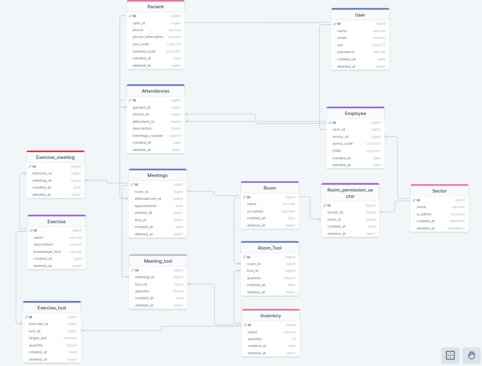

## Projeto Sistema de Atendimento de Fisioterapia

### Grupo C

### Integrantes:
Vitor Loch - VitorM3 
Danilo Formanski - Danilean 
Keniel Nunes - KenielDev 
Laura Silveira - Laurassilveirag 
Rafael Castro - RafaelDaSilvaCastro 
Vinicius Albino - Shinguek0 
Yuri Lopes - YuriLopesM 
Vitor Minatto - Minattoo

### Modelo Físico:
https://drawsql.app/teams/vitor-loch/diagrams/corpus 

  
### Dicionário de Dados:
<code>Excel ou tabela do Github (markdown)</code>

### Scripts DDL Criação do Database:
Banco de dados utilizado SQL Server versão 2022 - Azure. 
<code>1 arquivo SQL por objeto</code>

### Scripts Popula tabelas:
Banco de dados utilizado SQL Server versão 2022 - Azure. 
<code>1 arquivo SQL por objeto</code>

### Objetos de BD (stored procedure, triggers e functions):
<code>1 arquivo SQL por objeto</code>
  
### Código do sistema:
Linguagem de Programação Javascript  
<code>código fonte da aplicação</code>
